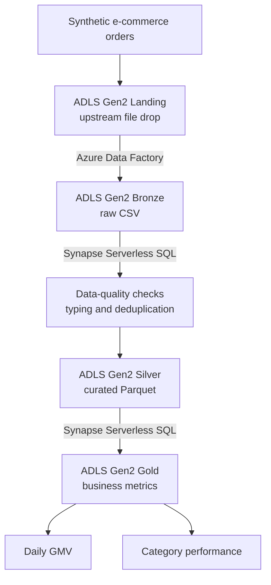

# Azure E-Commerce Analytics Pipeline

> **Implementation status:** In progress. The local repository foundation is in place, but no Azure resources, pipeline runs, Synapse queries, or analytical results have been verified yet.

A small, reproducible portfolio project that follows an e-commerce order file from an upstream landing area through Azure Data Factory ingestion, Synapse Serverless SQL validation and transformation, and business-facing analytical datasets in Azure Data Lake Storage Gen2.

## Architecture

The planned data flow is:



This diagram describes the intended architecture. It is not evidence of a successful Azure execution.

## Why I Built This

The project demonstrates how familiar data-engineering patterns—raw ingestion, layered storage, quality gates, curated datasets, and analytical outputs—map to a focused Azure implementation.

## Tech Stack

- Azure Data Factory for file-ingestion orchestration
- Azure Data Lake Storage Gen2 for Landing, Bronze, Silver, and Gold data
- Azure Synapse Analytics Serverless SQL for validation, transformation, and analytics
- SQL for data processing
- Python standard library for deterministic synthetic data generation
- Git and GitHub for version control and project evidence

## Data Flow

The planned flow starts with a synthetic CSV uploaded to Landing. Azure Data Factory will copy it unchanged to Bronze. Synapse Serverless SQL will inspect quality failures, remove invalid and duplicate records, and write Silver as Parquet. Business queries will read Silver and produce daily GMV and category-level metrics, with at least one result materialized in Gold.

## Dataset

The dataset will contain approximately 10,000 synthetic e-commerce order rows. A fixed random seed will make generation reproducible. A small, controlled set of duplicate IDs, missing customers, invalid quantities, and negative prices will be injected so the quality checks have real failures to detect.

No proprietary data is used.

## Data Quality

Planned checks include duplicate and null order IDs, null customer IDs, non-positive quantities, negative prices, invalid statuses, row count, and date range. Actual failure counts will be added only after the SQL has run successfully.

## Azure Data Factory

The planned `pl_ingest_orders` pipeline will copy `landing/orders/orders.csv` to `bronze/orders/orders.csv` using ADLS Gen2 datasets and managed identity authentication. Its definition and execution evidence will be added after a successful manual run.

## Synapse Serverless SQL

Serverless SQL will read Bronze CSV with an explicit schema, run data-quality checks, and create a validated, deduplicated Silver Parquet dataset with CETAS. No Dedicated SQL Pool or Spark Pool is part of this project.

## Business Metrics

Planned outputs are daily GMV, order volume, unique customers, average order value, category performance, and an optional status distribution. Revenue will include `PAID`, `SHIPPED`, and `DELIVERED` orders; `CANCELLED` orders will be excluded.

## Repository Structure

```text
azure-ecommerce-analytics-pipeline/
├── README.md
├── .gitignore
├── requirements.txt
├── src/
├── sample_data/
├── adf/
│   └── pipeline/
├── synapse/
└── docs/
    └── screenshots/
```

Files for the generator, Azure artifacts, SQL scripts, and detailed documentation will be added in their implementation phases.

## Running the Project

Detailed, reproducible instructions will be added as each phase is implemented and verified. Azure resources have not yet been created or tested.

## Results

No Azure execution results are reported yet. This section will contain measured quality counts, Silver validation results, business metrics, and screenshots only after successful runs.

## Cost-Conscious Design

The design deliberately uses a few-megabyte dataset, Synapse Serverless SQL, one brief ADF pipeline run per required test, and a single Azure region. It excludes Dedicated SQL Pools, Spark Pools, Mapping Data Flows, VMs, managed virtual networks, and unnecessary private endpoints.

## Security

Managed identities will be used where possible. Secrets, keys, SAS tokens, connection strings, passwords, and unnecessary subscription identifiers must not be committed. Azure role assignments will follow least-privilege principles for the project scope.

## What I Learned

This section will be completed after the implementation has been executed and reviewed.

## Possible Production Improvements

Potential future work includes incremental ingestion, watermark-based processing, CI/CD for Azure artifacts, infrastructure as code, monitoring and alerting, real-time ingestion, and a Power BI dashboard. These are not implemented in this MVP.

## License

This project is available under the MIT License.
