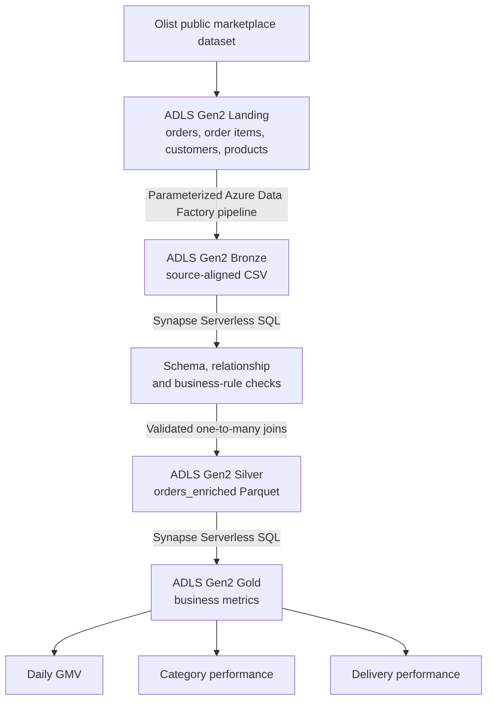

# Azure E-Commerce Analytics Pipeline

> **Implementation status:** In progress. The ADLS Gen2 account, `datalake` filesystem, folder structure, and four Landing uploads have been verified. Azure Data Factory and Synapse Serverless SQL have not yet been created or executed.

This project uses the public, anonymized Olist Brazilian e-commerce dataset to demonstrate an Azure-based marketplace analytics pipeline. Four relational source entities are ingested separately, validated, joined into a curated Parquet model, and transformed into business metrics.

## Architecture

The planned data flow is:



This diagram describes the intended architecture. It is not evidence of a successful Azure execution.

## Why I Built This

The project demonstrates how familiar data-engineering patterns—raw ingestion, layered storage, quality gates, curated datasets, and analytical outputs—map to a focused Azure implementation.

## Tech Stack

- Azure Data Factory for file-ingestion orchestration
- Azure Data Lake Storage Gen2 for Landing, Bronze, Silver, and Gold data
- Azure Synapse Analytics Serverless SQL for validation, transformation, and analytics
- SQL for data processing
- Git and GitHub for version control and project evidence

## Data Flow

The planned flow starts with four original Olist CSV files uploaded to separate Landing folders. A reusable ADF pipeline will copy each file unchanged to its matching Bronze folder. Synapse Serverless SQL will inspect schema, key, referential-integrity, null, and business-rule issues before joining the sources into an item-grain Silver Parquet dataset. Gold queries will produce daily GMV, category performance, and delivery performance.

## Dataset

The MVP uses these files from the [Brazilian E-Commerce Public Dataset by Olist](https://www.kaggle.com/datasets/olistbr/brazilian-ecommerce):

- `olist_orders_dataset.csv`: approximately one row per order
- `olist_order_items_dataset.csv`: one or more item rows per order
- `olist_customers_dataset.csv`: customer and location attributes
- `olist_products_dataset.csv`: product and category attributes

The dataset is anonymized and published under CC BY-NC-SA 4.0. Raw files are kept unchanged, stored locally, and excluded from Git to keep third-party data separate from this MIT-licensed code repository. No artificial quality failures are injected.

A local read-only preflight confirmed `99,441` orders, `112,650` order items, `99,441` customer rows, and `32,951` products. These counts verify source preparation only; they are not Synapse execution evidence.

## Data Quality

Planned checks cover source-key uniqueness, expected item-level composite keys, referential integrity between the four entities, required-field nulls, non-positive prices, negative freight, unexpected statuses, and invalid delivery timestamps. A zero-failure result is valid. Actual counts will be added only after the Serverless SQL checks run successfully.

## Azure Data Factory

The planned `pl_ingest_olist_files` pipeline will use `source_folder`, `file_name`, and `target_folder` parameters to reuse one Copy Activity across the selected source files. ADLS Gen2 access will use managed identity authentication. Its definition and execution evidence will be added only after successful manual runs.

## Synapse Serverless SQL

Serverless SQL will read each Bronze CSV with an explicit schema, run data-quality checks, and create `silver/orders_enriched/` as Parquet with CETAS. The Silver model is at order-item grain and joins orders to customers, items, and products. No Dedicated SQL Pool or Spark Pool is part of this project.

## Business Metrics

Planned outputs are daily GMV, category performance, and delivery performance. GMV is `SUM(price)` at item grain; freight is excluded. Order counts use `COUNT(DISTINCT order_id)` so multi-item orders are not double-counted. Commercial metrics will exclude cancelled orders. Actual results will be documented only after execution.

## Repository Structure

```text
azure-ecommerce-analytics-pipeline/
├── README.md
├── .gitignore
├── requirements.txt
├── sample_data/
│   ├── README.md
│   └── source_manifest.json
├── adf/
│   └── pipeline/
├── synapse/
└── docs/
    ├── source-model.md
    └── screenshots/
```

Raw Olist CSV files are downloaded locally into `sample_data/` but are ignored by Git. Azure artifacts, executable SQL, results, and screenshots will be added in their implementation phases.

## Running the Project

Download the Olist archive from the source page, then extract the four required files into `sample_data/` without renaming or modifying them. The verified Landing upload method uses Azure CLI with Microsoft Entra authentication (`--auth-mode login`); no storage keys or SAS tokens are used. Detailed instructions are maintained in `docs/azure-setup.md`.

## Verified Infrastructure So Far

Verified on 2026-09-24:

- Resource group `rg-ecommerce-analytics-demo` in West Europe
- Storage account `stecomolistomer260924`: Standard GPv2, LRS, TLS 1.2, HTTPS-only, hierarchical namespace enabled
- `datalake` filesystem with separate Landing, Bronze, Silver, and Gold directories
- Four original Olist CSV files uploaded to their Landing directories
- Azure file sizes match the locally verified source manifest
- Bronze contains no data yet; it will be populated by Azure Data Factory

## Results

No ADF or Synapse execution results are reported yet. This section will contain measured quality counts, Silver validation results, business metrics, and screenshots only after successful runs.

## Cost-Conscious Design

The design uses only four source entities from the public dataset, Synapse Serverless SQL, limited ADF runs, and a single Azure region. It excludes Dedicated SQL Pools, Spark Pools, Mapping Data Flows, VMs, managed virtual networks, and unnecessary private endpoints.

## Security

Managed identities will be used where possible. Secrets, keys, SAS tokens, connection strings, passwords, and unnecessary subscription identifiers must not be committed. Azure role assignments will follow least-privilege principles for the project scope.

## What I Learned

This section will be completed after the implementation has been executed and reviewed.

## Possible Production Improvements

Potential future work includes incremental ingestion, watermark-based processing, CI/CD for Azure artifacts, infrastructure as code, monitoring and alerting, real-time ingestion, and a Power BI dashboard. These are not implemented in this MVP.

## License

This project is available under the MIT License.
