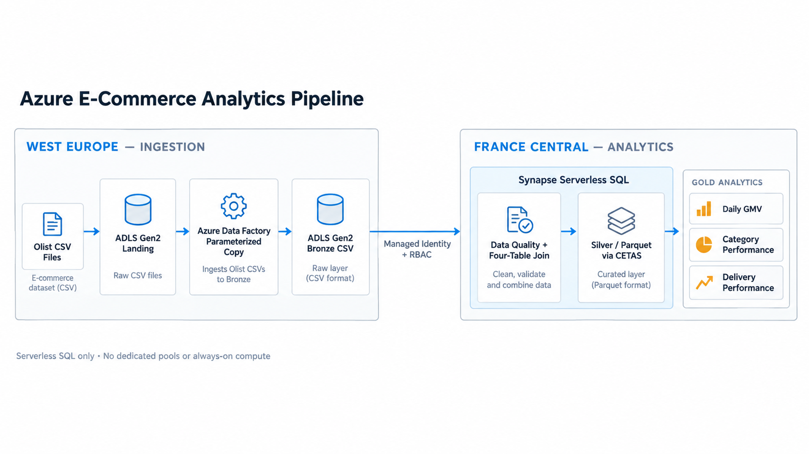

# Azure E-Commerce Analytics Pipeline

> **Implementation status:** Complete reference implementation. The repository contains the verified ADF ingestion artifacts and the full Synapse Serverless SQL Bronze, quality, Silver, and Gold workflow.

This project uses the public, anonymized Olist Brazilian e-commerce dataset to demonstrate an Azure-based marketplace analytics pipeline. Four relational source entities are ingested separately, validated, joined into a curated Parquet model, and transformed into business metrics.

## Architecture



The deployment separates ingestion and analytics: ADF and the project lake stay in West Europe, while Serverless SQL can run from a Synapse workspace in a permitted region and access the lake through managed identity.

## Why I Built This

The project demonstrates how familiar data-engineering patterns—raw ingestion, layered storage, quality gates, curated datasets, and analytical outputs—map to a focused Azure implementation.

## Tech Stack

- Azure Data Factory for file-ingestion orchestration
- Azure Data Lake Storage Gen2 for Landing, Bronze, Silver, and Gold data
- Azure Synapse Analytics Serverless SQL for validation, transformation, and analytics
- SQL for data processing
- Git and GitHub for version control and project evidence

## Data Flow

Four original Olist CSV files are uploaded to separate Landing folders. A reusable ADF pipeline copies each file unchanged to its matching Bronze folder. Synapse Serverless SQL applies explicit schemas and quality gates, joins the four sources into an item-grain Silver Parquet dataset, and produces Daily GMV, category performance, and delivery performance Gold datasets.

## Dataset

The MVP uses these files from the [Brazilian E-Commerce Public Dataset by Olist](https://www.kaggle.com/datasets/olistbr/brazilian-ecommerce):

- `olist_orders_dataset.csv`: approximately one row per order
- `olist_order_items_dataset.csv`: one or more item rows per order
- `olist_customers_dataset.csv`: customer and location attributes
- `olist_products_dataset.csv`: product and category attributes

The dataset is anonymized and published under CC BY-NC-SA 4.0. Raw files are kept unchanged, stored locally, and excluded from Git to keep third-party data separate from this MIT-licensed code repository. No artificial quality failures are injected.

A local read-only preflight confirmed `99,441` orders, `112,650` order items, `99,441` customer rows, and `32,951` products. These counts verify source preparation only; they are not Synapse execution evidence.

## Data Quality

Implemented checks cover source-key uniqueness, the item-level composite key, referential integrity, required-field nulls, non-positive prices, negative freight, unexpected statuses, and invalid delivery timestamps. Known source conditions are surfaced explicitly instead of silently repaired.

## Azure Data Factory

The verified `pl_ingest_olist_files` pipeline uses `source_folder`, `file_name`, and `target_folder` parameters to reuse one Copy Activity across the selected source files. A Binary dataset preserves each source file without parsing or reserializing it. The Data Factory system-assigned managed identity accesses ADLS Gen2 with `Storage Blob Data Contributor`; no key or SAS token is used.

Four manual runs succeeded on 2026-09-24. Each Bronze output matches its Landing input byte-for-byte in size. No trigger or recurring schedule is enabled.

## Synapse Serverless SQL

Serverless SQL reads each Bronze CSV through an explicitly typed view, runs data-quality checks, and creates `silver/orders_enriched/v1/` as Snappy-compressed Parquet with CETAS. Gold CETAS queries materialize all three business outputs. No Dedicated SQL Pool or Spark Pool is part of this project.

## Business Metrics

Outputs are Daily GMV, category performance, and delivery performance. GMV is `SUM(price)` at item grain; freight and cancelled orders are excluded. Order counts use `COUNT(DISTINCT order_id)` so multi-item orders are not double-counted.

## Repository Structure

```text
azure-ecommerce-analytics-pipeline/
├── README.md
├── .gitignore
├── requirements.txt
├── sample_data/
│   ├── README.md
│   └── source_manifest.json
├── adf/
│   └── pipeline/
├── synapse/               # executable Serverless SQL workflow
└── docs/
    ├── source-model.md
    └── screenshots/
```

Raw Olist CSV files are downloaded locally into `sample_data/` but are ignored by Git. Azure artifacts and executable SQL are versioned; third-party source files and secrets are excluded.

## Running the Project

Download the Olist archive from the source page, then extract the four required files into `sample_data/` without renaming or modifying them. The verified Landing upload method uses Azure CLI with Microsoft Entra authentication (`--auth-mode login`); no storage keys or SAS tokens are used. Detailed instructions are maintained in `docs/azure-setup.md`.

## Deployment Topology

Ingestion verified on 2026-09-24:

- Resource group `rg-ecommerce-analytics-demo` in West Europe
- Storage account `stecomolistomer260924`: Standard GPv2, LRS, TLS 1.2, HTTPS-only, hierarchical namespace enabled
- `datalake` filesystem with separate Landing, Bronze, Silver, and Gold directories
- Four original Olist CSV files uploaded to their Landing directories
- Azure file sizes match the locally verified source manifest
- Data Factory `adf-ecommerce-olist-260924` with a system-assigned managed identity
- Parameterized `pl_ingest_olist_files` pipeline with one Binary Copy Activity
- Four successful manual ADF runs populated the matching Bronze directories
- Synapse scripts use managed identity to access the existing `datalake` filesystem
- Serverless-only implementation: no Dedicated SQL Pool, Spark Pool, Databricks, VM, or Mapping Data Flow

## Results

ADF ingestion succeeded for orders, order items, customers, and products. The full Serverless SQL implementation is under `synapse/`. Its deterministic acceptance baseline is documented in [`docs/results.md`](docs/results.md): 112,650 Silver rows, 13,496,408.43 BRL commercial GMV, and an 8.11% late-delivery rate.

## Cost-Conscious Design

The design uses four source entities, limited ADF runs, Standard LRS storage, and pay-per-data-processed Synapse Serverless SQL. It excludes Dedicated SQL Pools, Spark Pools, Mapping Data Flows, VMs, managed virtual networks, and unnecessary private endpoints.

## Security

Managed identities are used for ADF and Synapse storage access. Secrets, keys, SAS tokens, connection strings, deployment passwords, and subscription identifiers are not committed. Role assignments are scoped to the project storage/filesystem.

## What I Learned

The project demonstrates source-grain preservation, parameterized ingestion, explicit schema-on-read, quality gates before promotion, one-to-many-safe aggregation, CETAS versioning, and cost-aware separation of orchestration from on-demand analytics.

## Possible Production Improvements

Potential future work includes incremental ingestion, watermark-based processing, CI/CD for Azure artifacts, infrastructure as code, monitoring and alerting, real-time ingestion, and a Power BI dashboard. These are not implemented in this MVP.

## License

This project is available under the MIT License.
