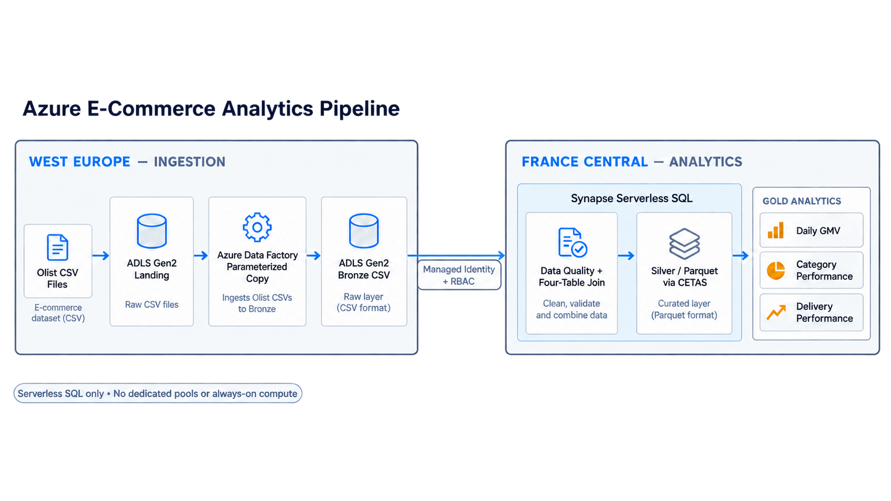

# Azure E-Commerce Analytics Pipeline

This project processes the public Olist marketplace dataset with Azure Data Factory, ADLS Gen2, and Synapse Serverless SQL. The ADF ingestion path is verified in Azure; the Synapse transformation layer is implemented in SQL and pending Azure execution.



## Overview

- Four real Olist source entities: orders, order items, customers, and products
- Parameterized ADF Binary Copy pipeline from Landing to Bronze
- ADLS Gen2 layout for Landing, Bronze, Silver, and Gold
- Synapse Serverless SQL views, quality checks, joins, and Parquet CETAS
- Marketplace metrics for revenue, categories, and delivery performance

## Architecture

Olist CSV files are uploaded to ADLS Landing in West Europe. ADF copies each file unchanged to Bronze. Synapse Serverless SQL is designed to read Bronze through managed identity, validate and join the sources, then write Silver and Gold Parquet datasets.

No Dedicated SQL Pool, Spark Pool, Databricks, VM, or Mapping Data Flow is used.

The cross-region storage/Synapse layout reflects subscription availability and is not the preferred production topology for latency or data-transfer cost.

## Data Model

| Entity | Grain |
| --- | --- |
| `orders` | One row per order |
| `order_items` | One row per `(order_id, order_item_id)` |
| `customers` | One row per order-scoped `customer_id` |
| `products` | One row per product |

Silver operates at order-item grain. Metrics use `COUNT(DISTINCT order_id)` after the one-to-many order/item join to avoid double counting.

## Pipeline

1. Upload the four original Olist CSV files to Landing.
2. Run the parameterized ADF pipeline to copy each file to Bronze.
3. Apply explicit schemas and data-quality checks with Serverless SQL.
4. Join the four sources into Silver Parquet with CETAS.
5. Create Gold datasets for marketplace metrics.

## Data Quality

The implemented SQL checks:

- duplicate orders, order items, customers, and products
- orphan order items
- orders without a customer match
- order items without a product match
- missing product category
- null `order_id`, `customer_id`, `product_id`, and `price`
- non-positive price and negative freight
- unexpected order status
- delivered order without a delivery timestamp
- delivery timestamp before purchase timestamp

## Business Metrics

- Daily GMV
- Average Order Value
- Category Performance
- Delivery Performance

GMV is `SUM(price)`. Freight and cancelled orders are excluded from commercial metrics. Order counts use `COUNT(DISTINCT order_id)`.

## Tech Stack

- Azure Data Factory
- Azure Data Lake Storage Gen2
- Azure Synapse Analytics Serverless SQL
- SQL
- Git / GitHub

## Verification Status

**Verified**

- Olist source preparation and immutable source manifest
- ADLS Gen2 Landing upload
- Parameterized Azure Data Factory ingestion
- Four successful ADF runs
- Bronze file sizes matching Landing

**Implemented, pending Azure execution**

- Synapse Bronze views
- Data-quality queries
- Silver Parquet CETAS
- Gold business metrics

## Results

[`docs/results.md`](docs/results.md) contains an **expected validation baseline** calculated locally from the immutable source CSVs. These values are not Azure Synapse execution results. Actual Synapse results should be added only after successful execution.

## Cost Design

The design uses Standard LRS storage, limited ADF executions, and pay-per-data-processed Serverless SQL. It does not use Dedicated SQL Pool, Spark Pool, Databricks, or VMs.

## Security

ADF and Synapse use managed identities for storage access. No storage keys, SAS tokens, subscription secrets, or tenant secrets are committed. Raw third-party CSV files are ignored by Git.

## Repository Structure

```text
adf/          # linked service, dataset, and parameterized pipeline definitions
synapse/      # Serverless SQL setup, quality, Silver, and Gold scripts
docs/         # architecture, setup, source model, and expected results
sample_data/  # source manifest and local download instructions; CSV files ignored
```

## Future Improvements

- Incremental ingestion
- CI/CD and infrastructure as code
- Monitoring and alerting
- Real-time ingestion
- BI dashboard

## License

Code is licensed under MIT. The Olist dataset is third-party content published under CC BY-NC-SA 4.0 and is not redistributed in this repository.
