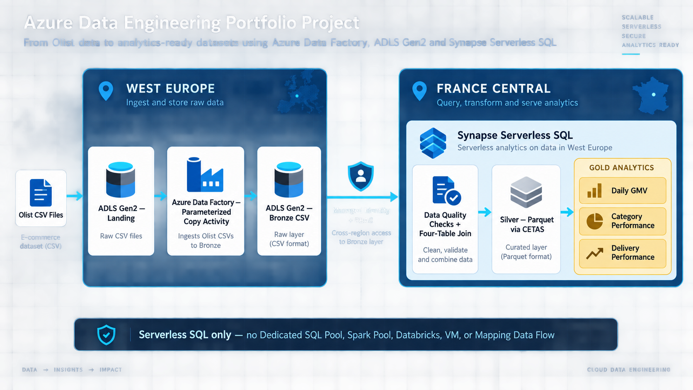

# Architecture

The implemented architecture ingests four relational Olist source entities into one ADLS Gen2 filesystem and analyzes them with Synapse Serverless SQL.



```text
Olist CSV files
    -> Landing: orders, order_items, customers, products
    -> ADF parameterized copy
    -> Bronze: source-aligned CSV
    -> Synapse Serverless SQL quality checks and joins
    -> Silver: orders_enriched Parquet
    -> Gold: daily_gmv, category_performance, delivery_performance
```

## Landing

Landing contains unchanged upstream files uploaded independently of ADF. Each source has its own folder so its schema and lifecycle remain clear.

## Bronze

Bronze is the platform-controlled raw copy created by the parameterized ADF pipeline. It preserves the original CSV representation and filenames.

## Silver

Silver contains `orders_enriched` at order-item grain. Each row represents one marketplace order item enriched with order lifecycle, customer, and product attributes. The design preserves the natural one-to-many relationship between orders and items rather than forcing an order-level table.

The planned join path is:

```text
orders.order_id = order_items.order_id
orders.customer_id = customers.customer_id
order_items.product_id = products.product_id
```

Quality checks run before promotion. Missing dimension matches remain visible in quality results and are not silently fabricated.

## Gold

Gold contains business-oriented datasets derived from Silver:

- Daily GMV: sum of item `price`, excluding cancelled orders; freight excluded
- Category performance: item-grain revenue and distinct order/customer measures
- Delivery performance: delivered orders with valid dates, including late-delivery rate

Order counts use distinct `order_id` values after the one-to-many join. Average order value divides GMV by distinct order count.

## Why Parquet

Parquet is planned for Silver and Gold because its columnar layout and embedded schema suit analytical queries and can reduce the amount of data scanned by Synapse Serverless SQL compared with repeatedly parsing raw CSV.

The executable implementation is maintained in `adf/` and `synapse/`; deterministic acceptance values are maintained in `docs/results.md`.
